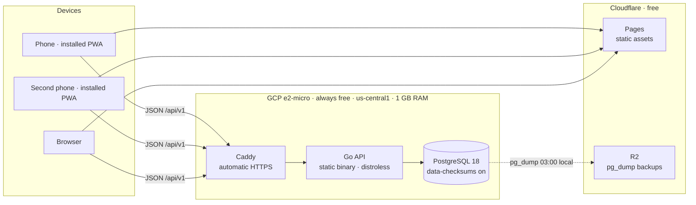
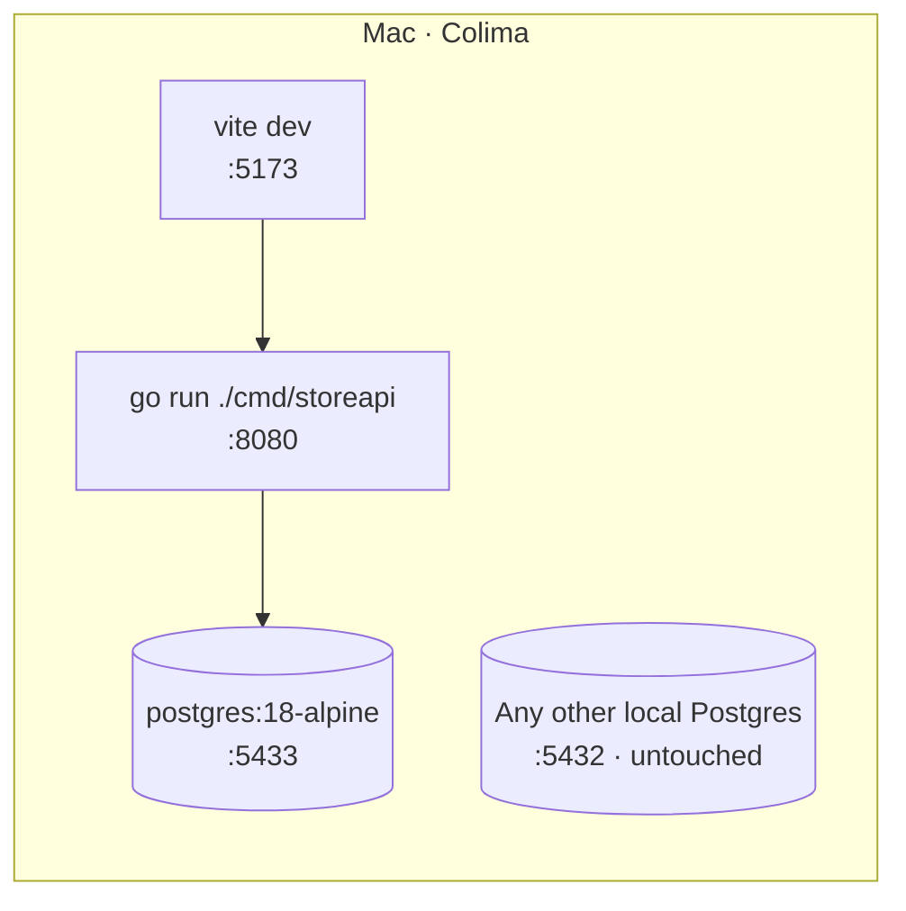
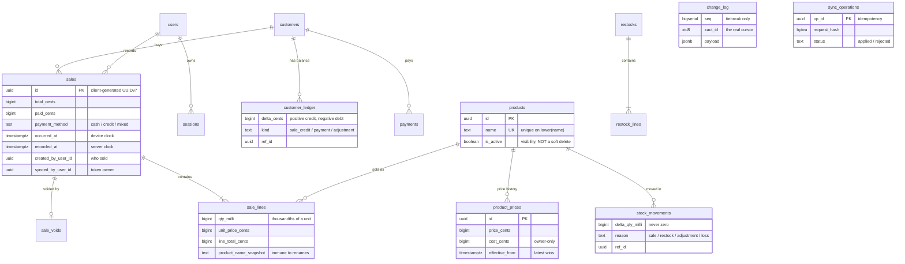
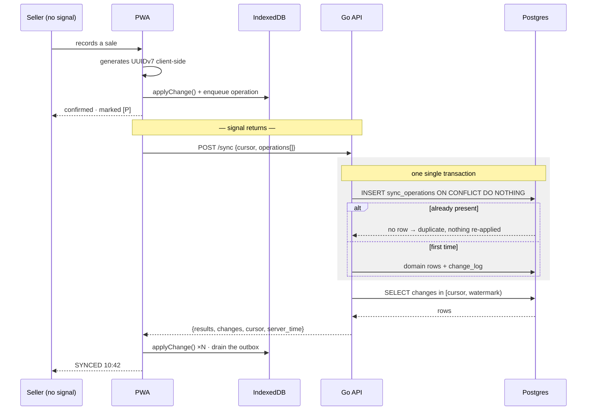
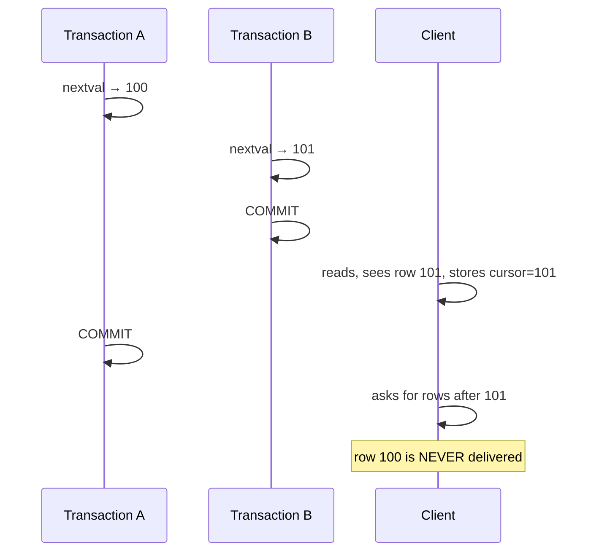
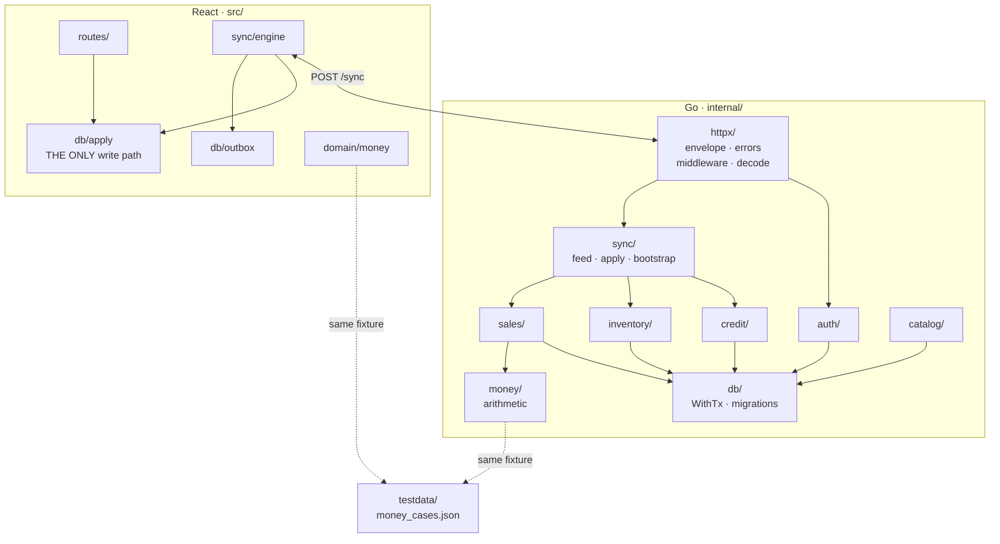

# Architecture

The diagrams are in Mermaid on purpose: GitHub renders them natively, they stay
versioned alongside the code, and they do not rot the way an exported PNG does
once nobody regenerates it.

> **Status:** items marked `[x]` are implemented and tested against a real
> Postgres. Items marked `[ ]` are designed but not written yet.

---

## The idea in one sentence

> **Every fact that touches money or stock is an immutable row. Every number the
> UI shows is a `SUM()`. Offline devices only ever `INSERT`.**

From that follows the property that makes everything else tractable: **no sync
conflict can exist by construction**. There is nothing to resolve because
nothing can collide. "Syncing" degrades into "ship rows both ways and dedupe by
ID".

And it is not a convention entrusted to the code. `store_app`, the role the API
runs as, **has no `UPDATE` or `DELETE` privilege** on any transactional table. An
`UPDATE sales SET total_cents = …` introduced by mistake six months from now
fails with `permission denied` on its first run, instead of silently corrupting
the books. See [ADR-009](DECISIONS.md).

---

## 1. Deployment

**The PWA is not served from the VM.** That is what keeps Compute Engine egress
well under the free tier's 1 GB/month: only API JSON (~6 MB/month) and backups
(~90 MB/month) leave that box. The assets, which are the bulk of the traffic, go
out through Cloudflare, which does not charge for bandwidth.

### Local development

The API does **not** run in a container during development: `go run` rebuilds in
under a second. The container is only the database. Port **5433** avoids
colliding with another Postgres that may already be installed.

---

## 2. Data model

This mirrors [`00001_init.sql`](../internal/db/migrations/00001_init.sql) as
currently migrated.

**No table stores a stock level, a balance or a current price. All three are
derived** through the `stock_levels`, `customer_balances` and `current_prices`
views.

### Why price is a ledger too

A mutable `products.price_cents` would be the **only** update-conflict surface
in the entire system, reintroducing exactly the class of problem the design
exists to eliminate. With a history, two devices changing the price while
offline simply land two rows: the newest `effective_from` wins, deterministically,
without a single line of conflict-resolution logic.

---

## 3. Offline synchronization

**The ID is generated by the client, not the server.** That is why replaying the
same operation is harmless, and why the outbox can retry forever without risking
a duplicated sale.

### The cursor: why it is not a `BIGSERIAL`

Postgres sequences are **not transactional**, so a cursor based on `seq` silently
drops rows:

At a few dozen sales a day the window is milliseconds wide and may never show up
in testing. In the field the symptom would be *"Tuesday's sale isn't on the other
phone"* — effectively impossible to diagnose.

The fix is a **watermark over `xid8`**: `pg_snapshot_xmin()` gives the lowest
transaction id still running, and every transaction below it has permanently
finished. The cursor stays a single monotonic integer, immune to clock skew, and
now also immune to the race. See [ADR-001](DECISIONS.md) and [SYNC.md](SYNC.md).

---

## 4. Module map

### The three rules this map enforces

**`sync/apply.go` is the only `switch`** over operation type, and each `case`
delegates to the domain function that already exists. Business logic has **one
implementation and two entry points** — never a "sync" version and an "online"
version that drift apart.

**`httpx/envelope.go` is the only place that can build a response body.** Not a
style rule. When any handler can assemble its own body, drift is a matter of
time: a second shape appears for one special case, then a third pagination
parameter that does almost what the other two do, and the client ends up paying
for it with an adapter that guesses which variant arrived. That adapter never
gets deleted.

**`testdata/money_cases.json` is read by both test suites.** It is the only thing
preventing the client from quoting the buyer one total while the server stores
another. Touch the arithmetic on one side and the other side's suite goes red.

---

## Where each decision comes from

This project does not start from nothing. It inherits judgement from the two
that came before it, and spends its novelty budget on what neither of them had.

### Carried over from *brutalist player*

| Decision | There | Here |
|---|---|---|
| Hand-written SQL over a typed driver, no ORM | `sqlx` with checked queries | `sqlc` over `pgx` |
| Numbered `.sql` migrations | 16 files | `00001_init.sql` |
| Tests with no mocks, real throwaway database | `tempfile` + migrate | `CREATE DATABASE … TEMPLATE` |
| First-class documentation | CLAUDE.md, DECISIONS.md, BACKLOG.md, numbered gotchas ledger | same |
| Brutalist visual system | radius 0, no gradients, transitions ≤80 ms | same |
| No component library | hand-rolled primitives | same |
| Strict TypeScript, Zustand | | same |

### Carried over from *alexandria library*

The instinct to **prefer the native option over the dependency**. There that
meant `node:sqlite` and `node:http` with no framework and zero dependencies.
Here it is the same decision three times: stdlib `net/http` routing instead of
chi or gin, `navigator.locks` instead of a mutual-exclusion library, and
hand-written validation instead of struct-tag magic.

One small detail survives too: the `_comment` key inside JSON files, explaining
the file from within. `testdata/money_cases.json` uses it.

### New territory

None of this exists in the two previous projects, and that is the point:

- **Go** as a server language.
- **Postgres** instead of SQLite, with more than one writer.
- **Offline-first synchronization.** Neither project has a service worker or
  IndexedDB, so there is no in-house pattern to copy.
- **Authentication**, since everything so far was single-user and local.
- **Owned infrastructure**: domain, HTTPS, deployment, verified backups.

### The three structural rules

Layered architecture on its own does not stop a file from growing without
bound. The failure mode is well known: when adding an endpoint costs six files,
nobody adds six — everyone piles onto the one that already exists, and the
layers end up as ceremony wrapped around a giant file. So the approach here is
**vertical slices plus one mechanical rule**:

1. A `.go` file that passes 400 lines gets split **by use case, not by layer**.
2. **No interfaces until there are two real implementations.** A `service` is a
   struct holding a `*pgxpool.Pool`, not a "port". The project's only interface
   is `db.Querier`, and it exists because it genuinely has two implementations:
   `pgx.Tx` and `*pgxpool.Pool`.
3. The handler does the work: decode → validate → service → envelope. Four lines
   of ceremony, not four files.

---

## Implementation status

| Component | Status |
|---|---|
| Schema, ledgers and derived views | `[x]` migrated and tested |
| Append-only enforcement via grants | `[x]` 12 tables verified in CI |
| Money arithmetic + shared fixture | `[x]` 32 cases + property test |
| Throwaway database harness | `[x]` runs as `store_app` |
| `httpx` (envelope, errors, middleware) | `[x]` |
| `auth` (argon2id, opaque tokens) | `[ ]` |
| `sales` (one sale, one transaction) | `[ ]` |
| `sync` (apply, feed, bootstrap) | `[ ]` naive feed in M1, `xid8` in M2 |
| PWA, outbox, sync engine | `[ ]` |
| Playwright | `[ ]` |
| Production infrastructure | `[ ]` |
