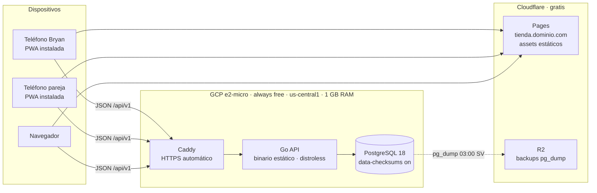
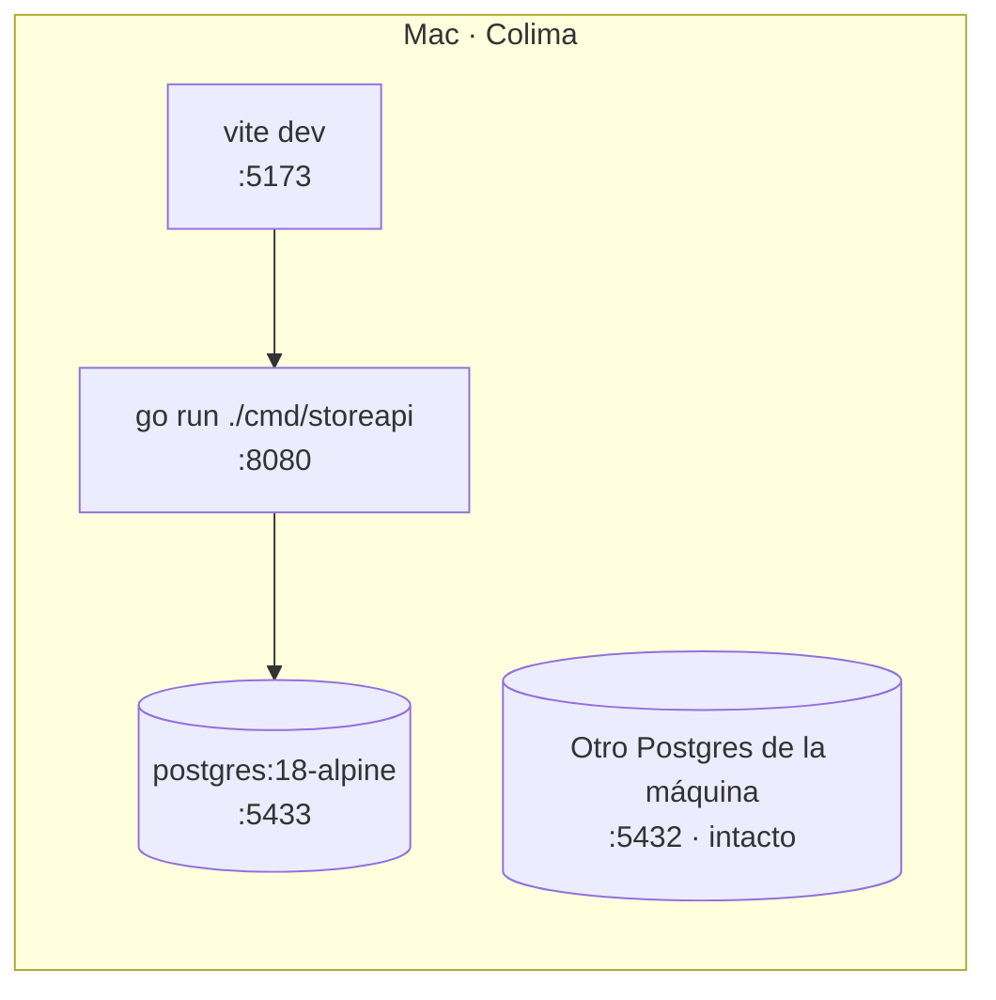
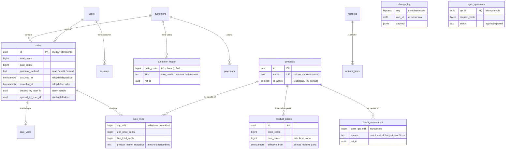
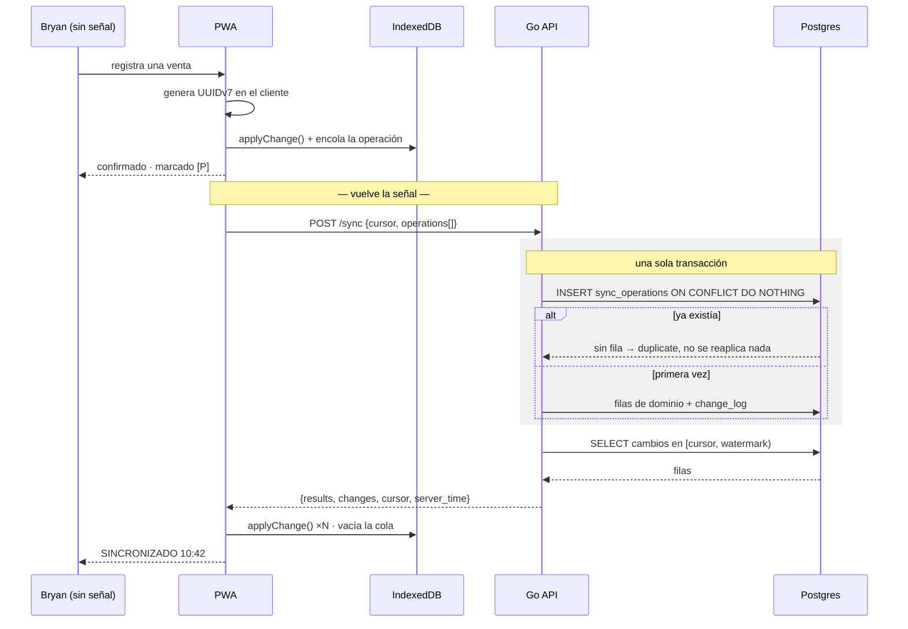
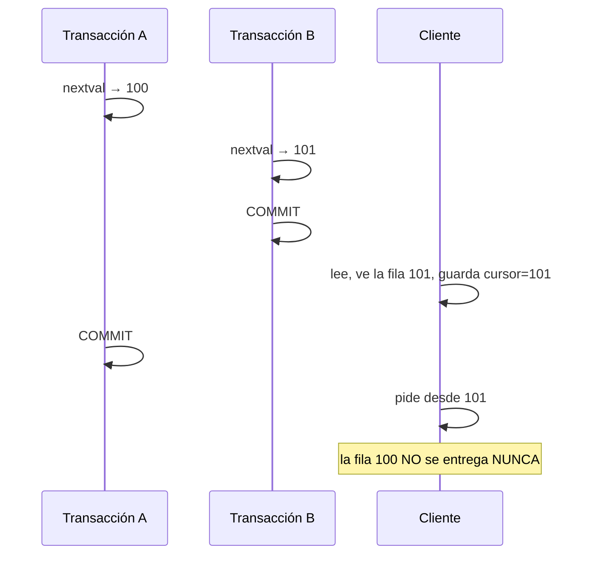
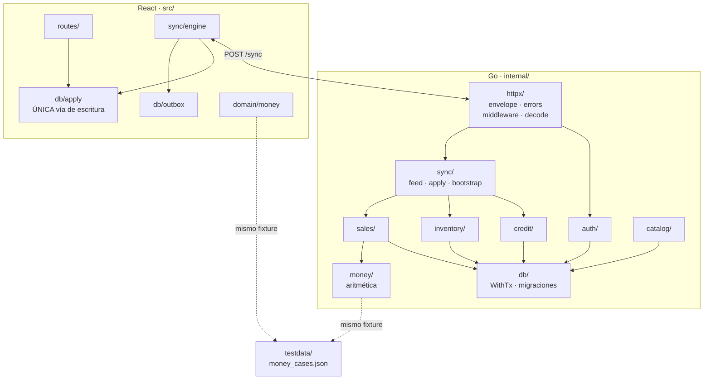

# Arquitectura

Los diagramas están en Mermaid a propósito: GitHub los renderiza nativo, viajan
versionados junto al código, y no se pudren como un PNG exportado que nadie
vuelve a regenerar.

> **Estado:** lo marcado con `[x]` ya está implementado y probado contra
> Postgres real. Lo marcado con `[ ]` está diseñado pero no escrito.
> Ver [BACKLOG.md](BACKLOG.md) para el orden.

---

## La idea en una frase

> **Todo dato que toca plata o stock es una fila inmutable. Todo número que la
> UI muestra es un `SUM()`. Los dispositivos offline solo hacen `INSERT`.**

De ahí sale la propiedad que hace tratable todo lo demás: **ningún conflicto de
sincronización puede existir por construcción**. No hay que resolverlos porque
no pueden ocurrir. "Sincronizar" se degrada a "mandar filas en ambos sentidos y
deduplicar por ID".

Y no es una convención confiada al código: `store_app`, el rol con el que corre
la API, **no tiene permiso de `UPDATE` ni `DELETE`** sobre ninguna tabla
transaccional. Un `UPDATE sales SET total_cents = …` introducido por error
dentro de seis meses falla con `permission denied` en la primera prueba, en vez
de corromper la contabilidad en silencio. Ver [ADR-009](DECISIONS.md).

---

## 1. Despliegue

**El PWA no se sirve desde la VM.** Es lo que mantiene el egress de Compute
Engine muy por debajo del límite de 1 GB/mes del free tier: por ahí solo pasa
JSON del API (~6 MB/mes) y los backups (~90 MB/mes). Los assets, que son el
grueso del tráfico, salen por Cloudflare, que no cobra ancho de banda.

### Desarrollo local

La API **no** corre en contenedor durante el desarrollo: `go run` recompila en
menos de un segundo. El contenedor es solo la base. El puerto es **5433** para
no tocar el Postgres que ya está instalado en la máquina en el 5432.

---

## 2. Modelo de datos

Refleja [`00001_init.sql`](../internal/db/migrations/00001_init.sql) tal como
está migrado hoy.

**Ninguna tabla guarda un stock, un saldo ni un precio vigente. Los tres se
derivan** por las vistas `stock_levels`, `customer_balances` y `current_prices`.

### Por qué el precio también es un ledger

Un `products.price_cents` mutable sería la **única** superficie de conflicto de
update de todo el sistema, y reintroduciría justo la clase de problema que el
diseño existe para eliminar. Con historial, dos dispositivos que cambian el
precio estando offline simplemente aterrizan dos filas: gana el `effective_from`
más nuevo, de forma determinista y sin una sola línea de resolución de
conflictos.

---

## 3. Sincronización offline

**El ID lo genera el cliente, no el servidor.** Por eso reenviar la misma
operación es inofensivo y la cola puede reintentar para siempre sin miedo a
duplicar una venta.

### El cursor: por qué no es un `BIGSERIAL`

Las secuencias de Postgres **no son transaccionales**, así que un cursor basado
en `seq` pierde filas en silencio:

A decenas de ventas por día la ventana es de milisegundos y puede no aparecer
jamás en pruebas. El síntoma en campo sería *"una venta del martes no está en el
otro teléfono"*, imposible de diagnosticar.

La solución es un **watermark sobre `xid8`**: `pg_snapshot_xmin()` da el
transaction id más bajo todavía en ejecución, y toda transacción por debajo de
ese valor ya terminó de forma permanente. El cursor sigue siendo un solo entero
monótono e inmune al reloj, y ahora también a la carrera. Ver
[ADR-001](DECISIONS.md) y [SYNC.md](SYNC.md).

---

## 4. Mapa de módulos

### Las tres reglas que este mapa impone

**`sync/apply.go` es el único `switch`** por tipo de operación, y cada `case`
delega a la función de dominio que ya existe. La lógica de negocio tiene **una
implementación y dos puertas de entrada** — nunca una versión "sync" y otra
"online" que se desincronizan.

**`httpx/envelope.go` es el único lugar que puede construir un cuerpo de
respuesta.** No es estilo. Cuando cualquier handler puede armar su propio
cuerpo, la deriva es cuestión de tiempo: aparece una segunda forma para un caso
puntual, después un tercer parámetro de paginación que hace casi lo mismo que
los otros dos, y el costo lo termina pagando el cliente con un adaptador que
adivina cuál variante llegó. Ese adaptador después no se borra nunca.

**`testdata/money_cases.json` lo leen las dos suites.** Es lo único que impide
que el cliente le diga un total al comprador y el servidor guarde otro. Si
tocás la aritmética de un lado, la suite del otro se pone roja.

---

## De dónde viene cada decisión

Este proyecto no arranca de cero: hereda criterio de los dos anteriores, y gasta
su presupuesto de novedad en lo que ninguno de los dos tenía.

### Lo que continúa de *brutalist player*

| Decisión | Allá | Acá |
|---|---|---|
| SQL a mano sobre driver tipado, sin ORM | `sqlx` con queries verificadas | `sqlc` sobre `pgx` |
| Migraciones numeradas en `.sql` | 16 archivos | `00001_init.sql` |
| Tests sin mocks, base real y efímera | `tempfile` + migrate | `CREATE DATABASE … TEMPLATE` |
| Documentación de primera clase | CLAUDE.md, DECISIONS.md, BACKLOG.md, bitácora de gotchas numerada | igual |
| Sistema visual brutalista | radio 0, sin gradientes, transiciones ≤80 ms | igual |
| Sin librerías de componentes | primitivas a mano | igual |
| TypeScript estricto, Zustand | | igual |

### Lo que continúa de *biblioteca de alejandría*

El instinto de **preferir lo nativo antes que la dependencia**. Allá eso fue
`node:sqlite` y `node:http` sin framework, con cero dependencias. Acá es la
misma decisión tres veces: `net/http` con el routing de stdlib en vez de
chi o gin, `navigator.locks` en vez de una librería de exclusión mutua, y
validación escrita a mano en vez de magia de struct tags.

También sobrevive un detalle chico: la clave `_comentario` dentro del JSON para
explicar el archivo desde adentro. `testdata/money_cases.json` la usa.

### Lo que es territorio nuevo

Nada de esto existe en los dos proyectos anteriores, y es el punto:

- **Go** como lenguaje de servidor.
- **Postgres** en vez de SQLite, con más de un usuario escribiendo.
- **Sincronización offline-first.** Ninguno de los dos tiene service worker ni
  IndexedDB: no hay patrón interno que copiar.
- **Autenticación**, porque hasta ahora todo fue de un solo usuario y local.
- **Infraestructura propia**: dominio, HTTPS, despliegue, backups verificados.

### Las tres reglas estructurales

La arquitectura por capas, por sí sola, no evita que un archivo crezca sin
control. El mecanismo de falla es conocido: cuando agregar un endpoint cuesta
seis archivos, nadie agrega los seis — todos apilan sobre el que ya existe, y
las capas terminan siendo ceremonia alrededor de un archivo gigante. Por eso acá
se va por **rebanadas verticales más una regla mecánica**:

1. Un `.go` que pasa de 400 líneas se parte **por caso de uso, no por capa**.
2. **Sin interfaces hasta tener dos implementaciones reales.** Un `service` es
   un struct con un `*pgxpool.Pool`, no un "port". La única interfaz del
   proyecto es `db.Querier`, y existe porque genuinamente tiene dos
   implementaciones: `pgx.Tx` y `*pgxpool.Pool`.
3. El handler hace el trabajo: decodificar → validar → servicio → envelope.
   Cuatro líneas de ceremonia, no cuatro archivos.

---

## Estado de implementación

| Componente | Estado |
|---|---|
| Esquema, ledgers y vistas derivadas | `[x]` migrado y probado |
| Blindaje append-only por `REVOKE` | `[x]` 12 tablas verificadas en CI |
| Aritmética de dinero + fixture compartido | `[x]` 32 casos + test de propiedad |
| Harness de base efímera | `[x]` corre como `store_app` |
| `httpx` (envelope, errores, middleware) | `[x]` |
| `auth` (argon2id, tokens opacos) | `[ ]` |
| `sales` (venta en una transacción) | `[ ]` |
| `sync` (apply, feed, bootstrap) | `[ ]` feed ingenuo en M1, `xid8` en M2 |
| PWA, outbox, motor de sync | `[ ]` |
| Playwright | `[ ]` |
| Infra de producción | `[ ]` |
